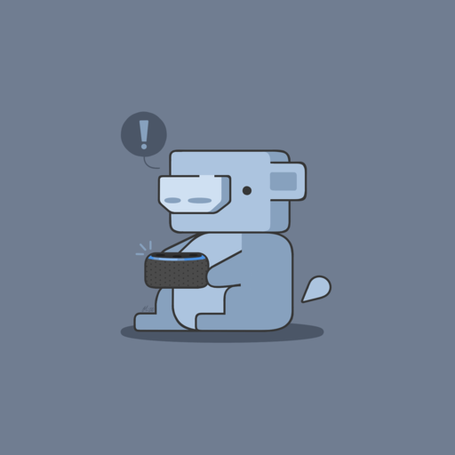

<h1 align="center">Alexuh</h1>

	<i>It’s Alexa, but for Discord</i>

A Voice Commanded Discord Bot with hand free controls

  <h3>
  	<a href="https://alexuh.com">
      Website
    </a>
  	 | 
    <a href="https://alexuh.com/invite">
      Invite the Bot
    </a>
     | 
    <a href="https://vimeo.com/435415946">
      Video Demo
    </a>
  </h3>

## Getting Started
Type “alexuh join” to have her join you in voice channel

Type “alexuh help” to see list of commands

## No More Alt+Tab
Don’t switch tabs to change the music, keep your gameplay uninterrupted and tell it to Alexuh.

- Control the Music (Alexuh, play Despacito)
- Control the Players (Alexuh, move Timmy to Timeout)
- Control the Server (Alexuh, kick Wumpus)

### Voice Commands
- Alexuh, Mic Check
- Alexuh, Tell me a Joke
- Alexuh, Play Despacito
- Alexuh, Volume 8 (1 - 10)
- Alexuh, Pause
- Alexuh, Resume
- Alexuh, Stop
- Alexuh, Move Tyler to Lobby (Lobby = Voice Channel Name)
- Alexuh, Move Me to Lobby
- Alexuh, Kick Tim
- Alexuh, Mute Gerald | Alexuh, Unmute Gerald
- Alexuh, Mute Everyone | Alexuh, Unmute Everyone
- Alexuh, Show me a Tiger (Tiger can be anything)
- Alexuh, Give me a Waifu
- Alexuh, Roast Tyler (Tyler = any name)
- Alexuh, Roast Me
- Alexuh, Spell Lantern (Lantern = any word)
- Alexuh, Repeat
- Alexuh, Leave

### Text Commands
- Alexuh, Join
- Alexuh, Vote
- Alexuh, TTS You Like Jazz? (TTS = Text to Speech)
- Alexuh, Play Despacito
- Alexuh, Stop
- Alexuh, Pause
- Alexuh, Resume
- Alexuh, Ping (Checks latency)
- Alexuh, Leave
- Alexuh, History (Logs Usage History)
